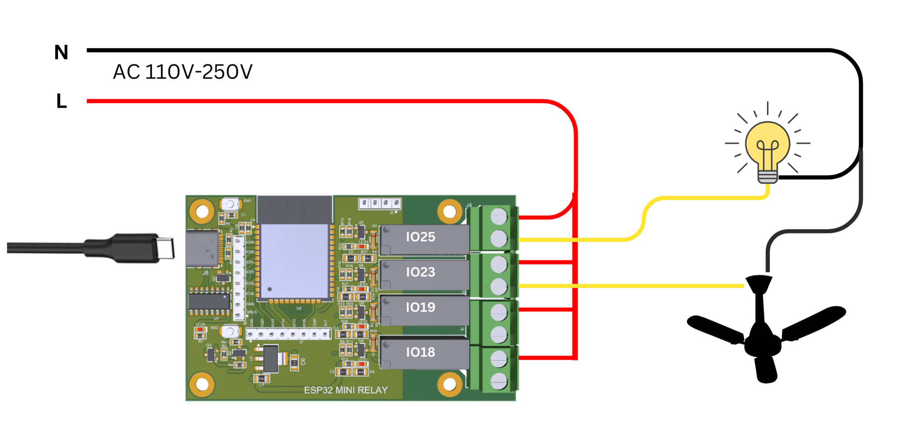

# ESP32-IoT-Relay-Board

This compact, card-sized ESP32-based relay board is designed for seamless integration into IoT and home automation projects. It features four relays connected to GPIO18, GPIO19, GPIO23, and GPIO25, allowing control of multiple electrical appliances. With a built-in Type-C port for both power and programming, along with an automatic programming circuit, flashing firmware is effortless—no need to press any buttons. Additionally, the board offers 12 extra GPIO pins accessible via an external header, making it a versatile solution for DIY enthusiasts and developers.

## Pinout
| Relay Board  | ESP32 GPIO Pins |
|  :---:      |  :---:                |
| Relay 1     | IO18  |
| Relay 2     | IO19  |
| Relay 3     | IO23  |
| Relay 4     | IO25  |
| SDA         | IO21  |
| SCL         | IO22  |

- Apart from these, 12 additional GPIO pins are also available on this board and can be accessed via the external header. The available GPIOs are as follows:
  - **Left Header :** IO32, IO33, IO34, IO35, IO36, IO39
  - **Bottom Header :** IO12, IO13, IO14, IO15, IO26, IO27
 
## Wiring Diagram 



**Disclaimer:**
When using this relay board for AC switching, ensure proper safety precautions. High-voltage AC can be dangerous and may cause electric shock or fire if not handled correctly. Only qualified personnel should perform installations. Always disconnect power before wiring, and use appropriate insulation and protection. The manufacturer is not responsible for any damage or injury caused by improper use.

## Step-by-Step Guide to Program this board in Arduino IDE

#### **Step 1:**  Install Arduino IDE
If you haven’t already installed the Arduino IDE, download and install it from the official website:

👉 [Download Arduino IDE](https://www.arduino.cc/en/software "Download Arduino IDE")

#### Step 2: Install ESP32 Board Support in Arduino IDE
1. Open **Arduino IDE**.
2. Go to **File** → **Preferences**.
3. In the "Additional Board Manager URLs" field, enter.

    https://raw.githubusercontent.com/espressif/arduino-esp32/gh-pages/package_esp32_index.json
4.  Click **OK**.
5. Go to **Tools** → **Board** →** Boards Manager**.
6. Search for "**ESP32**" and install the **ESP32 by Espressif Systems** package.

#### Step 3: Select Your ESP32 Board
1. Connect your ESP32-based relay board to the computer using a **USB Type-C cable**.
2. Open Arduino IDE and go to **Tools** → **Board** → Select **ESP32 Dev Module**.
3. Select the correct **COM Port**:
**Tools** → **Port** → Select the COM port where your ESP32 is connected.

#### Step 4: Basic Relay Control Code
Copy and paste the following code into the Arduino IDE to control the relays:

```cpp
// Define LED pins
const int ledPins[] = {18, 19, 23, 25};  //relay1, relay2, relay3, relay4
const int numLeds = sizeof(ledPins) / sizeof(ledPins[0]);

void setup() {
  // Initialize each pin as OUTPUT
  for (int i = 0; i < numLeds; i++) {
    pinMode(ledPins[i], OUTPUT);
    digitalWrite(ledPins[i], LOW); // Ensure all LEDs/Relays are off initially
  }
}

void loop() {
  // Turn on LEDs/Relays in sequence
  for (int i = 0; i < numLeds; i++) {
    digitalWrite(ledPins[i], HIGH);
    delay(500); // Delay for visibility
  }

  // Turn off LEDs/Relays in reverse sequence
  for (int i = numLeds - 1; i >= 0; i--) {
    digitalWrite(ledPins[i], LOW);
    delay(500); // Delay for visibility
  }
}
```
#### Step 5: Upload the Code
1. Click on the **Upload** button (✅).
2. The auto-programming circuit will handle the flashing process. You do not need to press any buttons.
3. Wait for the "Done uploading" message.

#### Step 6: Test the Relays
Once uploaded:

- You should hear clicking sounds as the relays switch ON and OFF.
- There are 4 LED indicator on the relay module for each relay, observe its behavior.

#### Step 7: Modify the Code for Your Needs
- Change delay() times for different switching speeds.
- Use Wi-Fi or Bluetooth to control relays remotely.
- Implement MQTT, HTTP, or WebSocket control.
